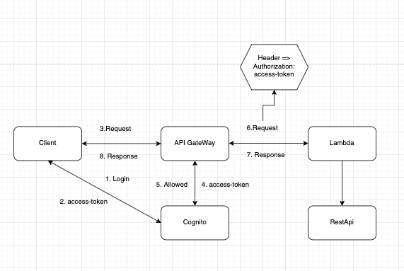

### **Learn Aws Lambda function With Api Express, Cognito, DynamoDB, S3, AppSync With Serverless Nodejs**

### **Init project**

```sh
$ npm init -y
```

### **Structure**

```text
.
├── README.md
├── common
│   ├── index.js
│   └── services
│       ├── aws-cognito.js
│       ├── aws-dynamodb.js
│       ├── aws-s3.js
│       ├── dynamoose.js
│       └── multer.js
├── configs.js
├── dist
├── graphql
│   └── schema.graphql
├── handlers
│   ├── app-sync
│   │   ├── create-todo.js
│   │   ├── delete-todo.js
│   │   ├── get-todo.js
│   │   ├── get-todos.js
│   │   └── update-todo.js
│   ├── auth
│   │   ├── loginUser.js
│   │   └── registerUser.js
│   ├── index.js
│   └── upload
│       ├── deleteImage.js
│       ├── getImage.js
│       ├── resizeImage.js
│       └── uploadImage.js
├── images
│   └── cognito-aws-follow-architecture.png
├── main.js
├── mapping-templates
│   ├── request
│   │   ├── mutation
│   │   │   ├── create-todo.request.vtl
│   │   │   ├── delete-todo.request.vtl
│   │   │   └── update-todo.request.vtl
│   │   └── query
│   │       └── get-todo.request.vtl
│   ├── resources
│   │   └── appsync-mapping-templates.yml
│   └── response
│       └── common.response.vtl
├── package-lock.json
├── package.json
├── serverless.yml
├── src
│   ├── routers
│   │   ├── home-router.js
│   │   ├── index.js
│   │   └── user-router.js
│   ├── server.js
│   └── utils
│       ├── error-util.js
│       ├── index.js
│       ├── response-util.js
│       ├── success-util.js
│       └── validate-util.js
└── webpack.config.js
```

### **Setup Environment**

- create account aws
- npm i -g serverless
- serverless create --template aws-nodejs --path folder-name
- serverless config credentials \
  --provider aws \
  --key AWS_ACCESS_KEY \
  --secret AWS_SECRET_KEY
- aws configure (aws cli)
- aws configure list => see inform aws

### **Setup file**

- APP_PORT=**\*\***
- APP_AWS_STAGE=**\*\***
- APP_AWS_REGION=**\*\***
- APP_AWS_ACCESS_KEY=**\*\***
- APP_AWS_SECRET_KEY=**\*\***
- APP_AWS_BUCKET_S3_UPLOAD=**\*\***
- APP_AWS_BUCKET_S3_UPLOAD_RESIZE=**\*\***
- APP_AWS_USER_POOL_NAME=**\*\***
- APP_AWS_USER_POOL_CLIENT_NAME=**\*\***
- APP_AWS_USER_POOL_ID=**\*\***
- APP_AWS_CLIENT_ID=**\*\***
- APP_DYNAMODB_USER_TABLE=**\*\***
- APP_DYNAMODB_TODO_TABLE=**\*\***

### **Command line**

- sls deploy => deploy app to aws
- sls invoke -f function-lambda-name => invoking functions locally and remotely
- sls logs -f function-lambda-name -t => tailing the logs
- sls remove --region region-aws => remove serverless
- aws s3 rb s3://bucket-name --force => remove bucket on s3

**Deploy dev**

```sh
  - deploy dev => npm run deploy:dev
```

**Deploy local**

```sh
  - deploy dev => npm run deploy:local
```

**Start local**

```sh
  - run local => npm start
```

### **Babel**

- Babel is a JavaScript converter or JavaScript transpiler
- We will convert code written in ES6 to ES5 so ExpressJs and Nodejs can understand.

### **1. Serverless**

- Make infrastructure management easier
- docs config yml: https://www.serverless.com/framework/docs/providers/aws/guide/serverless.yml

### **2. Lambda Function**

- docs: https://docs.aws.amazon.com/lambda/latest/dg/welcome.html

  - Lambda is a compute service that lets you run code without provisioning or managing servers
  - Lambda runs your code on a high-availability compute infrastructure and performs all of the administration of the compute resources, including server and operating system maintenance, capacity provisioning and automatic scaling, and logging
    
  **Invoke your Lambda functions**
    - Build data-processing triggers for AWS services such as Amazon Simple Storage Service (Amazon S3) and Amazon DynamoDB.

    - Process streaming data stored in Amazon Kinesis.

    - Create your own backend that operates at AWS scale, performance, and security.

### **3. Cognito**

- syntax: https://docs.aws.amazon.com/AWSCloudFormation/latest/UserGuide/aws-resource-cognito-userpool.html
- docs sdk: https://docs.aws.amazon.com/AWSJavaScriptSDK/latest/AWS/CognitoIdentityServiceProvider.html
- cognito-aws-follow-architecture:

****

### **4. DynamoDB**

- docs sdk: https://docs.aws.amazon.com/AWSJavaScriptSDK/latest/AWS/DynamoDB.html

### **5. S3**

- docs sdk: https://docs.aws.amazon.com/AWSJavaScriptSDK/latest/AWS/S3.html
- docs: https://docs.aws.amazon.com/lambda/latest/dg/with-s3-example.html
- event bridge: https://docs.aws.amazon.com/AmazonS3/latest/userguide/EventBridge.html

  - Upload image
  - Get image
  - Delete image
  - Presigned url
  - Resize image

### **6. AppSync**

- **What is AWS AppSync?**

  - AWS AppSync provides a robust, scalable GraphQL interface for application developers to combine data from multiple sources, including Amazon DynamoDB, AWS Lambda, and HTTP APIs.

- **Features of AWS AppSync**

  - Powerful GraphQL schema editing through the AWS AppSync console, including automatic GraphQL schema generation from DynamoDB
  - Efficient data caching
  - Integration with Amazon Cognito user pools for fine-grained access control at a per-field level

- **Scalars type of AWS AppSync**

  - https://docs.aws.amazon.com/appsync/latest/devguide/scalars.html

### **Curl**

- **/auth/register**

  ```sh
  - $ curl -d '{"email":"demo@gmail.com", "password":"123456"}' -X POST https://**********.amazonaws.com/auth/register
  ```

- **/auth/login**

  ```sh
  - $ curl -d '{"email":"demo@gmail.com", "password":"123456"}' -X POST https://**********.amazonaws.com/auth/login
  ```

- **/**
  ```sh
  curl -H Authorization: "X-Access-Token" https://**********.amazonaws.com/
  ```
